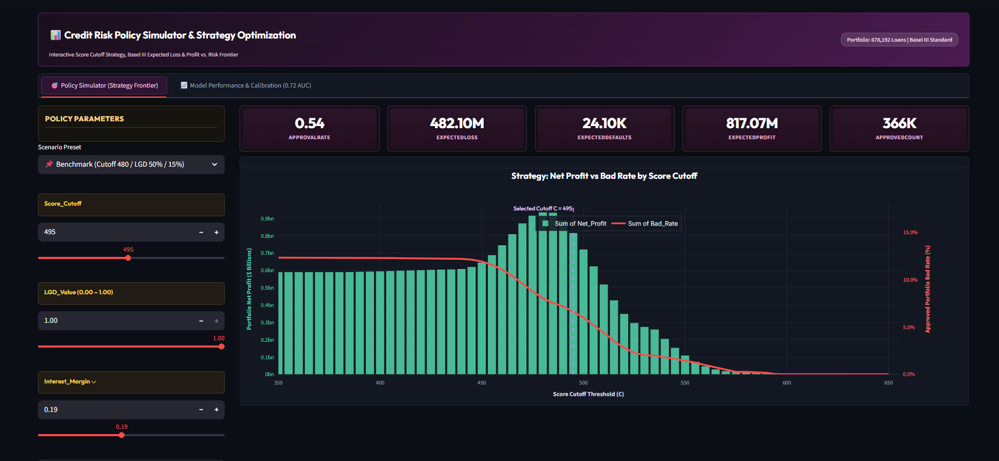
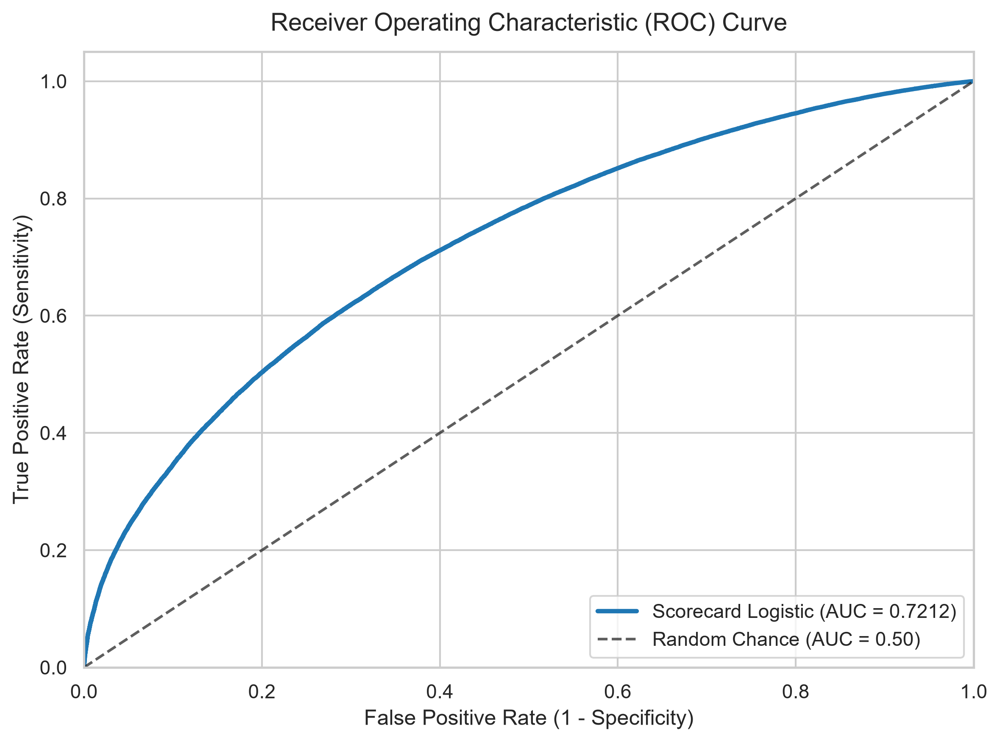
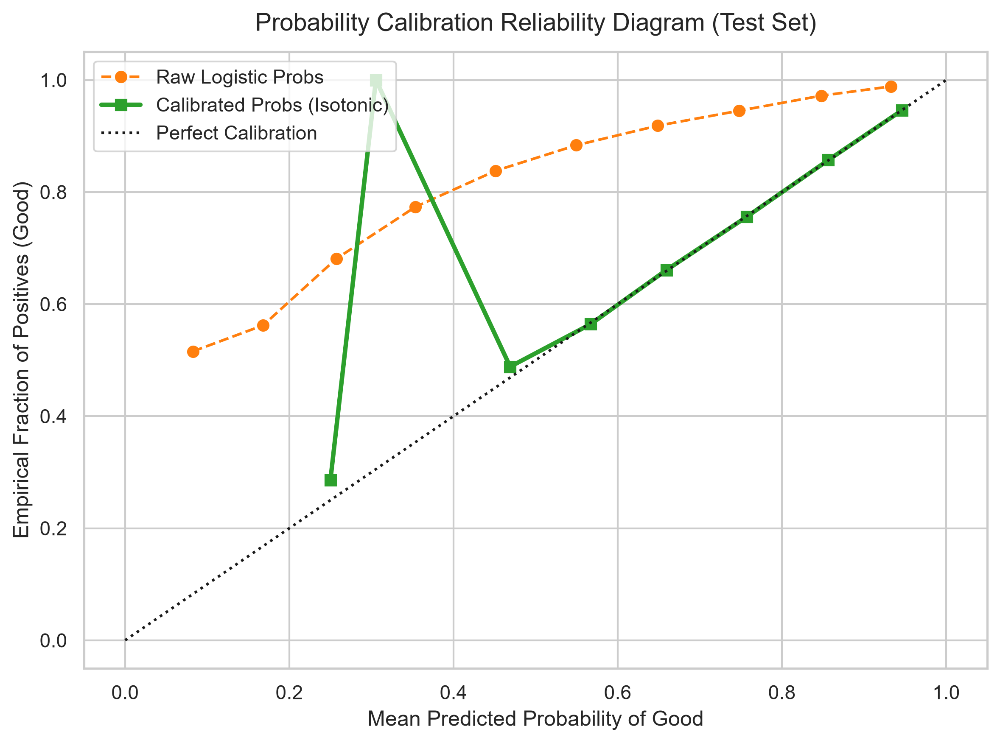

# Credit Risk Scorecard Development Pipeline and Policy Simulator

A modular, production-grade credit risk modeling framework and interactive policy simulator for developing, calibrating, evaluating, and deploying regulatory-compliant Weight of Evidence (WoE) credit scorecards.

---

## Executive Interface and Diagnostic Figures

### Interactive Policy Simulator Dashboard



### Model Diagnostics and Strategy Optimization

| Discrimination (ROC Curve) | Probability Calibration |
| :---: | :---: |
|  |  |

---

## Key Features and Capabilities

### 1. End-to-End Scorecard Pipeline
* **Data Hygiene and Leakage Prevention**: Identifies and drops forward-looking outcome variables (e.g., recoveries, collection fees, post-origination FICO updates) and maps loan statuses to standard binary performance outcomes.
* **Three-Way Stratified Partitioning**: Splits data into Train (60%), Calibration (20%), and Held-Out Test (20%) sets to ensure strictly unbiased parameter fitting and probability calibration.
* **Optimal WoE Binning**: Employs shallow Decision Tree (`CART`) segmentations with sample size constraints ($\ge 5\%$ per leaf) and Laplace smoothing ($\alpha = 0.5$) to generate monotonic, stable bin cuts.
* **Two-Stage Feature Selection**:
  * Information Value (IV) filtering ($0.02 \le \text{IV} \le 0.55$) to isolate medium-to-strong predictive features without overfit.
  * Collinearity filtering ($|r| > 0.70$) to eliminate multicollinearity while preserving highest-IV attributes.
* **Balanced Logistic Regression**: Fits regularized generalized linear models on WoE-transformed predictors.
* **Non-Parametric Isotonic Calibration**: Applies Pool Adjacent Violators Algorithm (PAVA) on the validation partition to map raw log-odds to empirically calibrated default probabilities ($\text{PD}$).
* **Additive Scorecard Scaling**: Scales scores via standard Points to Double Odds (PDO) formulations:
  $$\text{Score} = \text{Base\_Points} + \sum_{j} \text{Points}(X_j \in B_{j,k})$$
* **Basel III Master Scale**: Aggregates calibrated scores into 10 discrete rating grades (AAA to D) with regulatory PD midpoints, default risk weights, and decile tracking.

### 2. Strategy and Underwriting Policy Simulation
* **Cutoff Optimization Grid Search**: Evaluates portfolio economics across the entire credit score spectrum ([350, 650]).
* **Basel III Expected Loss Modeling**: Computes credit risk provisions using $\text{EL} = \text{PD} \times \text{LGD} \times \text{EAD}$.
* **Economic Objective Optimization**: Automatically determines optimal approval thresholds under multiple corporate strategies:
  * Maximum Net Profit ($C^*$)
  * Conservative Risk-Mitigated Cutoff
  * Aggressive Portfolio Growth Cutoff
  * Balanced Risk-Return Frontier
* **Multi-Scenario Stress Testing**: Evaluates policy sensitivity across multi-tier Loss Given Default (LGD) scenarios and net interest margin assumptions.

### 3. Interactive Streamlit Dashboard (`app.py`)
* **Policy Simulator (Strategy Frontier) Tab**:
  * Scenario preset selector (Benchmark, Standard Recovery, Full Write-Off Shock, Aggressive Expansion, Conservative Policy, Custom).
  * Real-time sliders and numeric inputs for Score Cutoff, LGD Value (0.00–1.00), and Interest Margin.
  * Live executive KPI scorecards: Approval Rate, Expected Loss, Expected Defaults, Expected Profit, and Approved Count.
  * Dual-axis Plotly strategy chart: Net Profit bars vs. Portfolio Bad Rate curves with optimal cutoff markers ($C^*$).
  * Heatmapped loss exposure table broken down by credit score bucket with cumulative portfolio metrics.
* **Model Performance & Calibration Tab**:
  * Core discrimination metrics: AUC (0.72), Gini Coefficient (0.44), and Kolmogorov-Smirnov / KS statistic (0.32).
  * Dual-axis decile calibration reliability chart comparing loan counts, empirical bad rates, and calibrated default probabilities across score deciles.
  * Feature predictive power ranking chart based on Information Value (IV).

---

## Project Architecture

```
loan-default/
│
├── config/
│   ├── __init__.py
│   └── settings.py               # Hyperparameters, column schema, mappings, scaling constants
│
├── src/
│   ├── __init__.py
│   ├── data/
│   │   ├── __init__.py
│   │   ├── loader.py             # Schema-validated data ingestion with gzip streaming
│   │   └── cleaner.py            # Target encoding and target leakage elimination
│   │
│   ├── features/
│   │   ├── __init__.py
│   │   ├── engineering.py        # Date transformation, tenure parsing, stratified splitting
│   │   ├── woe.py                # WoEBinning transformer with CART decision tree cuts & Laplace smoothing
│   │   └── selection.py          # IV filtering and correlation-based redundancy removal
│   │
│   ├── models/
│   │   ├── __init__.py
│   │   ├── train.py              # Logistic Regression model training and persistence
│   │   └── calibration.py        # Isotonic Regression probability calibration (PAVA)
│   │
│   ├── scorecard/
│   │   ├── __init__.py
│   │   ├── scaling.py            # PDO scorecard scaling and additive points matrix generation
│   │   ├── master_scale.py       # Basel III Master Scale band aggregation and decile risk mapping
│   │   ├── strategy.py           # Cutoff grid search, economic optimization, and scenario matrix
│   │   └── simulation_engine.py  # Portfolio policy simulation engine and caching layer
│   │
│   ├── evaluation/
│   │   ├── __init__.py
│   │   ├── metrics.py            # Discrimination (AUC, Gini, KS) and Brier calibration scores
│   │   └── plots.py              # Diagnostic plotting suite (ROC, Calibration, IV, Strategy, Deciles)
│   │
│   └── pipeline.py               # End-to-end scorecard development pipeline orchestrator
│
├── outputs/                      # Generated model artifacts, tables, and figures
│   ├── figures/                  # Publication-ready diagnostic charts (PNG)
│   ├── scorecard_points.csv      # Additive point lookup table per feature bin
│   ├── master_scale.csv          # Basel III rating master scale table
│   ├── decile_performance.csv    # Decile risk distribution breakdown
│   ├── cutoff_strategy_simulation.csv # Simulation results across score thresholds
│   ├── executive_policy_comparison.csv # Scenario matrix comparison table
│   ├── logistic_model.joblib      # Persisted trained classification model
│   └── ui.png                    # Dashboard user interface capture
│
├── main.py                       # CLI entrypoint for full pipeline execution
├── app.py                        # Streamlit interactive policy simulator dashboard
├── SCORECARD_MATHEMATICS.md      # Comprehensive mathematical, statistical, and regulatory documentation
└── README.md                     # Project overview and reference guide
```

---

## Quickstart

### 1. Run the Pipeline via CLI

Execute the complete end-to-end pipeline on the full dataset:
```bash
python main.py --data ac.gz --output-dir outputs
```

Execute a fast verification run on a subsample:
```bash
python main.py --data ac.gz --sample-size 10000 --output-dir outputs
```

Execute with custom scorecard scaling parameters:
```bash
python main.py --pdo 50 --base-score 600 --base-odds 50 --output-dir outputs
```

### 2. Launch the Interactive Policy Dashboard

Start the Streamlit policy optimization simulator:
```bash
streamlit run app.py
```

Access the dashboard in your web browser at `http://localhost:8501`.

---

## Methodological Summary

| Stage | Method / Algorithm | Primary Objective |
| :--- | :--- | :--- |
| Target Definition | Binary Outcome Mapping ($1 = \text{Good}, 0 = \text{Bad}$) | Isolate credit defaults from non-credit closures |
| Data Split | Stratified 60/20/20 Partition | Separate training, probability calibration, and test sets |
| Discretization | Shallow CART Decision Tree ($\ge 5\%$ min leaf) | Capture non-linear patterns and enforce monotonicity |
| Smoothing | Laplace Estimator ($\alpha = 0.5$) | Prevent division by zero and extreme log-odds weights |
| Feature Filtering | Information Value ($0.02 \le \text{IV} \le 0.55$) | Retain medium-to-strong predictive features |
| Collinearity Check | Pearson Correlation ($|r| > 0.70$) | Drop redundant collinear predictors |
| Classification | Regularized Logistic Regression | Estimate baseline log-odds of good credit |
| Calibration | Isotonic Regression (PAVA) | Align predicted scores with true empirical default rates |
| Point Scaling | Points to Double Odds (PDO = 20, Base = 600) | Generate additive, interpretable scoring lookup tables |
| Portfolio Strategy | Grid Search Cutoff & Expected Loss Optimization | Maximize underwriting net profit under risk constraints |

---

